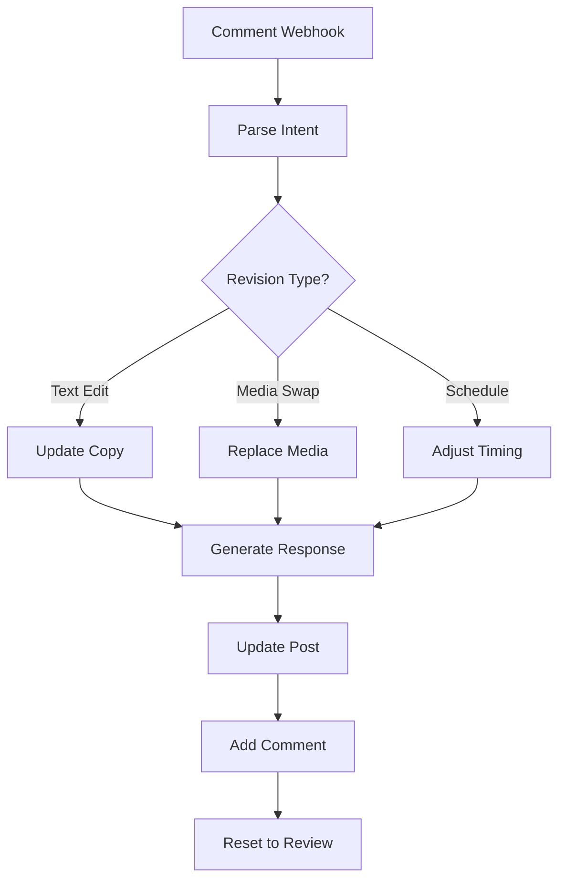

# Hybrid Mixpost + n8n Implementation Plan

## Overview
A comprehensive implementation plan for building an automated social media publishing system that combines Mixpost Pro for client management and social media posting with n8n for content orchestration and AI-powered features.

**Total Project Time: 76 <E (63.3 hours) for MVP + 20 <E (16.7 hours) for bonus features**

---

## Webhook Payload Structures

### Airtable ’ n8n ’ Mixpost
```json
{
  "recordId": "recXXXXXX",
  "brandId": "brand_uuid",
  "workspaceId": "mixpost_workspace_uuid",
  "content": {
    "text": "Post content from Airtable",
    "mediaUrls": ["https://url1.jpg", "https://url2.mp4"],
    "platforms": ["facebook", "instagram", "youtube"],
    "type": "post|reel|story|short",
    "scheduledAt": "2025-02-01T10:00:00Z"
  },
  "metadata": {
    "campaignId": "optional",
    "tags": ["tag1", "tag2"]
  }
}
```

### Mixpost ’ n8n ’ Airtable (Comments/Metrics)
```json
{
  "event": "comment.created|post.published|metrics.updated",
  "postId": "mixpost_post_uuid",
  "recordId": "recXXXXXX",
  "data": {
    "comment": "Client feedback text",
    "metrics": {
      "views": 1000,
      "likes": 50,
      "comments": 10,
      "shares": 5
    }
  }
}
```

---

## =Ë Implementation Phases

## <¯ Phase 1: Infrastructure & Mixpost Setup
**Total: 16 <E (13.3 hours)**

### Milestone 1.1: Mixpost Deployment (6 <E)

#### 1. Docker Setup & Configuration (2 <E)
- [ ] Create docker-compose.yml with Mixpost Pro, MySQL, Caddy
- [ ] Configure environment variables and volumes
- [ ] Set up SSL certificates with Caddy
- [ ] Test container startup and connectivity

#### 2. Mixpost Initial Configuration (2 <E)
- [ ] Run database migrations
- [ ] Create admin account and API token
- [ ] Configure SMTP for email notifications
- [ ] Set up webhook endpoints
- [ ] Store admin token in secure location

#### 3. Demo Workspace Creation (2 <E)
- [ ] Create your personal brand workspace
- [ ] Connect your social accounts (FB, IG, YouTube)
- [ ] Test manual posting to verify connections
- [ ] Document OAuth flow for each platform

### Milestone 1.2: Airtable Schema Updates (4 <E)

#### 1. Content Table Enhancements (2 <E)
- [ ] Add mixpost_post_id field
- [ ] Add workspace_id field
- [ ] Add publishing_status field
- [ ] Add last_webhook_response field
- [ ] Create formula fields for platform detection

#### 2. Analytics Table Creation (2 <E)
- [ ] Create metrics table structure
- [ ] Link to content records
- [ ] Add timestamp fields for tracking
- [ ] Create views for reporting
- [ ] Set up rollup fields for aggregations

### Milestone 1.3: n8n Foundation (6 <E)

#### 1. Webhook Receivers Setup (2 <E)
- [ ] Create Airtable ’ n8n webhook endpoint
- [ ] Create Mixpost ’ n8n webhook endpoint
- [ ] Add authentication and validation
- [ ] Configure CORS settings
- [ ] Test webhook connectivity

#### 2. Mixpost API Integration (2 <E)
- [ ] Configure HTTP nodes for Mixpost API
- [ ] Create reusable sub-workflows
- [ ] Test authentication and basic calls
- [ ] Document API endpoints used
- [ ] Create error response handlers

#### 3. Error Handling Framework (2 <E)
- [ ] Create error notification workflow
- [ ] Set up retry logic with exponential backoff
- [ ] Configure Slack/email alerts
- [ ] Create error logging to Airtable
- [ ] Test failure scenarios

---

## <¯ Phase 2: Core Content Pipeline
**Total: 20 <E (16.7 hours)**

### Milestone 2.1: Content Publishing Flow (10 <E)

#### 1. Media Processing Pipeline (4 <E)
- [ ] Download media from URLs/Google Drive
- [ ] Validate formats and sizes
- [ ] Upload to Mixpost media library
- [ ] Handle multiple media items
- [ ] Create media ID mapping table
- [ ] Implement retry logic for failed uploads

#### 2. Post Creation Workflow (4 <E)
- [ ] Map Airtable fields to Mixpost schema
- [ ] Handle platform-specific formatting
- [ ] Set scheduling parameters
- [ ] Create post via Mixpost API
- [ ] Implement platform detection logic
- [ ] Handle immediate vs scheduled posting

#### 3. Status Sync Back (2 <E)
- [ ] Update Airtable with Mixpost post ID
- [ ] Set initial status
- [ ] Log webhook response
- [ ] Handle errors gracefully
- [ ] Create status change notifications

### Milestone 2.2: Comment & Revision System (10 <E)

#### 1. Comment Webhook Handler (2 <E)
- [ ] Receive Mixpost comment webhooks
- [ ] Parse and validate payload
- [ ] Route to appropriate workflow
- [ ] Extract client intent
- [ ] Log comment activity

#### 2. Revision Agent Architecture (4 <E)
- [ ] Design prompt templates
- [ ] Set up OpenAI/Claude integration
- [ ] Create context management system
- [ ] Build response formatting
- [ ] Implement brand guideline injection
- [ ] Create testing prompts

#### 3. Automated Updates Flow (4 <E)
- [ ] Parse client feedback with LLM
- [ ] Generate content updates
- [ ] Update post via Mixpost API
- [ ] Add acknowledgment comment
- [ ] Reset post status to review
- [ ] Notify relevant parties

---

## <¯ Phase 3: Client Onboarding & Management
**Total: 12 <E (10 hours)**

### Milestone 3.1: Client Setup Automation (6 <E)

#### 1. Workspace Creation Script (3 <E)
- [ ] Read client data from Airtable
- [ ] Create Mixpost workspace via API
- [ ] Configure webhook for workspace
- [ ] Store credentials in Airtable
- [ ] Generate unique workspace identifiers
- [ ] Create initial user accounts

#### 2. Social Account Connection Guide (3 <E)
- [ ] Document Facebook Business Manager setup
- [ ] Create YouTube API walkthrough
- [ ] Build client onboarding checklist
- [ ] Create Loom video templates
- [ ] Design permission request templates
- [ ] Build troubleshooting guide

### Milestone 3.2: Permissions & Access (6 <E)

#### 1. Facebook Business Manager Setup (3 <E)
- [ ] Document partner request process
- [ ] Create permission templates
- [ ] Test with demo account
- [ ] Build troubleshooting guide
- [ ] Create client instruction sheet
- [ ] Set up test scenarios

#### 2. YouTube API Configuration (3 <E)
- [ ] Enable YouTube Data API v3
- [ ] Configure OAuth consent screen
- [ ] Set up channel permissions
- [ ] Test upload and analytics access
- [ ] Document quota limits
- [ ] Create usage monitoring

---

## <¯ Phase 4: Analytics & Metrics
**Total: 16 <E (13.3 hours)**

### Milestone 4.1: Metrics Collection (8 <E)

#### 1. Scheduled Metrics Fetcher (4 <E)
- [ ] Create 24h, 48h, 7d collection workflows
- [ ] Fetch metrics from Mixpost API
- [ ] Parse platform-specific data
- [ ] Handle missing/delayed metrics
- [ ] Implement retry logic
- [ ] Create metric validation rules

#### 2. Airtable Analytics Writer (4 <E)
- [ ] Map metrics to analytics table
- [ ] Calculate engagement rates
- [ ] Track growth over time
- [ ] Create rollup summaries
- [ ] Build historical tracking
- [ ] Implement data deduplication

### Milestone 4.2: Reporting System (8 <E)

#### 1. Client Metrics Dashboard (4 <E)
- [ ] Create Airtable interfaces
- [ ] Build performance views
- [ ] Set up automated snapshots
- [ ] Design growth tracking
- [ ] Create comparative analysis views
- [ ] Build export functionality

#### 2. Weekly Reports Automation (4 <E)
- [ ] Aggregate weekly metrics
- [ ] Generate performance summaries
- [ ] Create email templates
- [ ] Automate distribution
- [ ] Build report archiving
- [ ] Create custom report triggers

---

## <¯ Phase 5: Testing & Optimization
**Total: 12 <E (10 hours)**

### Milestone 5.1: End-to-End Testing (6 <E)

#### 1. Content Pipeline Testing (3 <E)
- [ ] Test with various content types
- [ ] Verify all platforms work
- [ ] Check scheduling accuracy
- [ ] Validate error handling
- [ ] Test edge cases
- [ ] Create test data sets

#### 2. Comment System Testing (3 <E)
- [ ] Simulate client feedback
- [ ] Test revision agent responses
- [ ] Verify update accuracy
- [ ] Check notification flow
- [ ] Test concurrent comments
- [ ] Validate status transitions

### Milestone 5.2: Beta Launch Prep (6 <E)

#### 1. Documentation (3 <E)
- [ ] Create admin guide
- [ ] Build client handbook
- [ ] Document troubleshooting
- [ ] Prepare FAQ
- [ ] Create video tutorials
- [ ] Build quick reference cards

#### 2. Monitoring Setup (3 <E)
- [ ] Configure uptime monitoring
- [ ] Set up performance tracking
- [ ] Create operational dashboards
- [ ] Establish SLAs
- [ ] Build alert rules
- [ ] Create incident response plan

---

## <¯ Bonus Phase: Advanced Features
**Total: 20 <E (16.7 hours)**

### Milestone B.1: Facebook Ads Integration (10 <E)

#### 1. Ads API Setup (4 <E)
- [ ] Configure Marketing API access
- [ ] Set up ad account permissions
- [ ] Create campaign templates
- [ ] Test creative uploads
- [ ] Build audience targeting options
- [ ] Implement budget controls

#### 2. Batch Ad Creation (6 <E)
- [ ] Build campaign creator workflow
- [ ] Implement targeting options
- [ ] Handle budget allocation
- [ ] Create performance tracking
- [ ] Build A/B testing framework
- [ ] Implement approval workflows

### Milestone B.2: Advanced Automation (10 <E)

#### 1. Content Optimization (5 <E)
- [ ] A/B testing framework
- [ ] Best time to post analysis
- [ ] Hashtag optimization
- [ ] Cross-platform adaptation
- [ ] Performance-based scheduling
- [ ] Content recommendation engine

#### 2. Instagram DM Features (5 <E)
- [ ] Explore Mixpost DM capabilities
- [ ] Set up auto-responses
- [ ] Create escalation rules
- [ ] Build conversation tracking
- [ ] Implement FAQ bot
- [ ] Create human handoff system

---

## =Ê Project Summary

| Phase | Milestones | Pomodoros | Hours |
|-------|------------|-----------|-------|
| Infrastructure & Setup | 3 | 16 <E | 13.3 |
| Core Content Pipeline | 2 | 20 <E | 16.7 |
| Client Management | 2 | 12 <E | 10.0 |
| Analytics & Metrics | 2 | 16 <E | 13.3 |
| Testing & Launch | 2 | 12 <E | 10.0 |
| **MVP TOTAL** | **11** | **76 <E** | **63.3** |
| Bonus Features | 2 | 20 <E | 16.7 |
| **FULL TOTAL** | **13** | **96 <E** | **80.0** |

---

## =° Cost Calculation Framework

### Token Usage Estimates
- **Content Processing**: ~500-1000 tokens per post
- **Revision Agent**: ~1500-2000 tokens per revision
- **Metrics Summaries**: ~300 tokens per report

### Monthly Calculations (5 clients)
```
Daily content: 5 clients × 6 hours × 10 clips = 300 posts
Monthly posts: 300 × 30 = 9,000 posts
Revision rate: 20% = 1,800 revisions
Weekly reports: 5 clients × 4 weeks = 20 reports

Token usage:
- Publishing: 9,000 × 750 = 6.75M tokens
- Revisions: 1,800 × 1,750 = 3.15M tokens  
- Reports: 20 × 300 = 6K tokens
- Total: ~10M tokens/month

Cost (GPT-4):
- Input: 5M × $0.01 = $50
- Output: 5M × $0.03 = $150
- Monthly LLM cost: ~$200-250
```

### Infrastructure Costs
- VPS upgrade: +$20-40/month
- Mixpost Pro: $149 (one-time)
- Backup/monitoring: $10/month

### Pricing Recommendation
- Target margin: 80%
- Infrastructure: $300/month
- Price per client: $2,000/month
- Revenue (5 clients): $10,000/month
- Profit: $9,700/month

---

## > Revision Agent Design

### Architecture Overview


### Agent Prompt Template
```
You are a social media content editor. 

Original Content: {original_text}
Client Feedback: {comment_text}
Brand Guidelines: {guidelines}

Task: Apply the requested changes while maintaining brand voice.

Output format:
{
  "changes": ["specific change 1", "specific change 2"],
  "updated_content": "revised text",
  "acknowledgment": "Friendly confirmation message"
}
```

---

## =€ Quick Start Order

1. **Day 1**: Phase 1 (Infrastructure) - Get Mixpost running
2. **Day 2-3**: Phase 2 (Pipeline) - Connect Airtable to Mixpost
3. **Day 4**: Phase 3 (Clients) - Set up demo client
4. **Day 5**: Phase 4 (Analytics) - Complete the loop
5. **Day 6**: Phase 5 (Testing) - Verify everything works

---

## =Ý Notes Section

### Platform-Specific Notes:
- [ ] Document YouTube Shorts detection formula
- [ ] Create Instagram Reels specifications
- [ ] Build Facebook video requirements
- [ ] List TikTok integration options

### Client Onboarding Checklist:
- [ ] Airtable record created
- [ ] Mixpost workspace configured
- [ ] Social accounts connected
- [ ] Webhooks registered
- [ ] Test post published
- [ ] Analytics flowing

### Monitoring Checklist:
- [ ] API rate limits tracked
- [ ] Token usage monitored
- [ ] Error rates acceptable
- [ ] Response times optimal
- [ ] Storage usage healthy
- [ ] Backup system functional