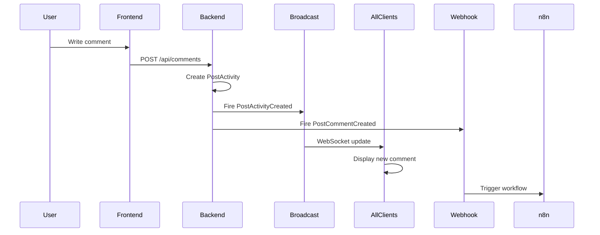
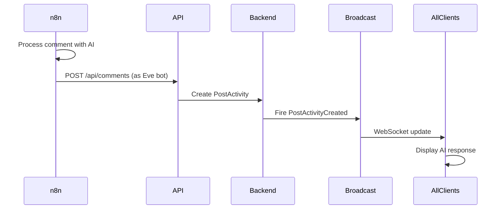

# Mixpost & n8n Real-Time Comment System Documentation

## Overview

This document describes the real-time comment system implementation in Mixpost and its integration with n8n for AI-powered comment responses. The system uses Laravel Broadcasting with WebSockets to provide instant updates across all connected clients without page reloads.

## System Architecture

### Core Components

1. **Broadcasting Infrastructure**
   - **Driver**: Pusher or Laravel Reverb
   - **Frontend**: Laravel Echo with Pusher JS client
   - **Backend**: Laravel Broadcasting with private channels
   - **Configuration**: `/root/everyday-os/packages/mixpost-custom/src/Broadcast.php`

2. **Event System**
   - **PostActivityCreated**: Broadcasts when any comment is created
   - **PostCommentCreated**: Triggers webhook to n8n
   - **PostCommentUpdated**: Broadcasts comment edits
   - **PostCommentDeleted**: Broadcasts comment deletions
   - **PostCommentReactionsUpdated**: Broadcasts reaction changes

3. **API Endpoints**
   - **Create Comment**: `POST /api/{workspace}/posts/{post}/comments`
   - **List Comments**: `GET /api/{workspace}/posts/{post}/comments`
   - **Controller**: `PostCommentsController.php`

## Real-Time Comment Flow

### User Posts Comment


### n8n AI Response Flow


## Key Files and Their Roles

### Backend Files

1. **Broadcasting Configuration**
   - `/root/everyday-os/packages/mixpost-custom/src/Broadcast.php`
   - Handles Pusher/Reverb configuration
   - Provides Echo options for frontend

2. **Event Classes**
   - `/root/everyday-os/packages/mixpost-custom/src/Events/Post/PostActivityCreated.php`
   - Implements `ShouldBroadcast` interface
   - Broadcasts to private channel: `mixpost_posts.{post_uuid}`
   - Includes full activity data with user and reactions

3. **Webhook Management**
   - `/root/everyday-os/packages/mixpost-custom/src/WebhookManager.php`
   - Registers all webhook events including `PostCommentCreated`
   - Manages workspace-level webhooks

4. **API Controller**
   - `/root/everyday-os/packages/mixpost-custom/src/Http/Api/Controllers/Workspace/Post/PostCommentsController.php`
   - Handles comment creation via API
   - Supports user_id parameter for bot accounts

### Frontend Files

1. **Broadcasting Composable**
   - `/root/everyday-os/packages/mixpost-custom/resources/js/Composables/useBroadcast.js`
   - Manages Laravel Echo connection
   - Provides methods for channel subscription

2. **Post Broadcasting Handler**
   - `/root/everyday-os/packages/mixpost-custom/resources/js/Composables/usePostBroadcast.js`
   - Listens for PostActivityCreated events
   - Updates comment list in real-time
   - Handles comment updates and deletions

3. **Activity Management**
   - `/root/everyday-os/packages/mixpost-custom/resources/js/Composables/usePostActivity.js`
   - Manages comment state and UI updates
   - Handles thread views and nested comments

## Configuration

### Environment Variables

Add to `/root/everyday-os/docker/.env`:

```env
# Broadcasting Driver (pusher or reverb)
BROADCAST_DRIVER=pusher

# Pusher Configuration
PUSHER_APP_ID=your_app_id
PUSHER_APP_KEY=your_app_key
PUSHER_APP_SECRET=your_app_secret
PUSHER_HOST=
PUSHER_PORT=443
PUSHER_SCHEME=https
PUSHER_APP_CLUSTER=mt1

# OR Reverb Configuration
REVERB_APP_ID=your_app_id
REVERB_APP_KEY=your_app_key
REVERB_APP_SECRET=your_app_secret
REVERB_HOST=localhost
REVERB_PORT=8080
REVERB_SCHEME=http
```

### n8n Bot User Setup

1. **Eve Bot Configuration**
   - User ID: 2
   - Name: Eve
   - Role: AI Assistant
   - Must have permission to post comments

2. **API Authentication**
   - Generate API token for Eve user
   - Store token in n8n credentials
   - Use Bearer token authentication

### Webhook Configuration

1. **Enable Webhooks in Mixpost**
   - Navigate to Workspace Settings → Webhooks
   - Add webhook URL pointing to n8n
   - Select `post.comment.created` event
   - Save webhook secret for validation

2. **n8n Webhook Node Setup**
   ```json
   {
     "webhookUrl": "https://n8n.yourdomain.com/webhook/mixpost-comments",
     "httpMethod": "POST",
     "responseMode": "onReceived",
     "options": {
       "rawBody": true
     }
   }
   ```

## API Usage

### Creating a Comment (n8n to Mixpost)

```bash
curl -X POST https://social.yourdomain.com/api/workspace-uuid/posts/post-uuid/comments \
  -H "Authorization: Bearer YOUR_API_TOKEN" \
  -H "Content-Type: application/json" \
  -d '{
    "text": "This is an AI-generated response from Eve!",
    "user_id": 2,
    "parent_id": null
  }'
```

### Response Structure
```json
{
  "id": "comment-uuid",
  "text": "This is an AI-generated response from Eve!",
  "user": {
    "id": 2,
    "name": "Eve",
    "avatar": "..."
  },
  "reactions": [],
  "children_count": 0,
  "timestamps": {
    "created_at": "2024-01-01T12:00:00Z"
  }
}
```

## Real-Time Event Payload

### PostActivityCreated Broadcast Data
```json
{
  "id": "activity-uuid",
  "type": "comment",
  "text": "Comment text",
  "user": {
    "id": 2,
    "name": "Eve"
  },
  "reactions": [],
  "children_count": 0,
  "is_child": false,
  "timestamps": {
    "Iso8601": {
      "created_at": "2024-01-01T12:00:00Z"
    },
    "localized": {
      "created_at": "Jan 1, 2024 12:00 PM"
    }
  }
}
```

## Frontend Integration

### Listening for Real-Time Updates

The frontend automatically subscribes to the post's broadcast channel when viewing comments:

```javascript
// This happens automatically in usePostBroadcast.js
const channel = `mixpost_posts.${postUuid}`;
Echo.private(channel)
  .listen('Post.PostActivityCreated', (activity) => {
    // Comment is automatically added to the UI
    // No page reload needed!
  });
```

### Key Features
- **Automatic Updates**: New comments appear instantly
- **Optimistic UI**: Immediate feedback while saving
- **Thread Support**: Nested comments update in real-time
- **Reaction Updates**: Live reaction counts
- **Deletion Sync**: Removed comments disappear for all users

## Troubleshooting

### Comments Not Appearing in Real-Time

1. **Check WebSocket Connection**
   ```javascript
   // In browser console
   console.log(window.Echo.connector.pusher.connection.state);
   // Should show "connected"
   ```

2. **Verify Broadcasting Configuration**
   ```bash
   cd /root/everyday-os/docker
   docker compose exec mixpost php artisan config:cache
   docker compose restart mixpost
   ```

3. **Test Broadcasting**
   ```bash
   docker compose exec mixpost php artisan tinker
   >>> broadcast(new \Inovector\Mixpost\Events\Post\PostActivityCreated($activity));
   ```

### n8n Comments Not Posting

1. **Verify API Token**
   - Check token is valid and not expired
   - Ensure Eve user (ID: 2) has proper permissions

2. **Check Webhook Delivery**
   - Look for webhook logs in Mixpost admin
   - Verify n8n is receiving webhook payloads

3. **API Response Errors**
   - Check n8n execution logs
   - Verify correct workspace and post UUIDs
   - Ensure comment text is not empty

### WebSocket Connection Issues

1. **Pusher Configuration**
   - Verify Pusher credentials are correct
   - Check cluster setting matches your Pusher app
   - Ensure firewall allows WebSocket connections

2. **Reverb Configuration**
   - Check Reverb is running: `docker compose ps reverb`
   - Verify port 8080 is accessible
   - Check SSL certificates if using HTTPS

## Performance Considerations

### Optimization Tips

1. **Broadcasting Queue**
   - Events are queued by default for better performance
   - Ensure queue workers are running:
     ```bash
     docker compose exec mixpost php artisan queue:work
     ```

2. **Channel Authorization**
   - Private channels require authentication
   - Cache authorization results when possible
   - Use proper indexes on database queries

3. **Frontend Efficiency**
   - Comments are added to existing DOM without full re-render
   - Virtual scrolling for long comment threads
   - Debounced typing indicators

## Security

### Important Security Measures

1. **Private Channels**
   - All post broadcasts use private channels
   - Requires authentication to subscribe
   - Channel name includes post UUID for isolation

2. **Webhook Validation**
   - Verify webhook signatures
   - Validate payload structure
   - Rate limit webhook endpoints

3. **API Authentication**
   - Use strong API tokens
   - Rotate tokens regularly
   - Limit token permissions to minimum required

## Testing the Integration

### Manual Testing Steps

1. **Test Real-Time Updates**
   - Open two browser windows with same post
   - Post comment in window 1
   - Verify it appears in window 2 without refresh

2. **Test n8n Integration**
   - Post a comment manually
   - Wait for n8n webhook to trigger
   - Verify AI response appears in real-time

3. **Test Error Handling**
   - Disconnect internet briefly
   - Post comment
   - Reconnect and verify comment syncs

### Automated Testing

```php
// Test broadcasting event
public function test_comment_creation_broadcasts_event()
{
    Event::fake([PostActivityCreated::class]);
    
    $post = Post::factory()->create();
    $comment = $post->addComment('Test comment', $userId);
    
    Event::assertDispatched(PostActivityCreated::class, function ($event) use ($comment) {
        return $event->activity->id === $comment->id;
    });
}
```

## Monitoring

### Key Metrics to Track

1. **WebSocket Metrics**
   - Connection count
   - Message throughput
   - Connection drop rate
   - Reconnection frequency

2. **Webhook Metrics**
   - Delivery success rate
   - Response time from n8n
   - Failed delivery count
   - Retry attempts

3. **Comment Metrics**
   - Time to display (real-time latency)
   - API response time
   - Queue processing time
   - Broadcast delivery time

### Logging

Enable detailed logging for debugging:

```php
// In config/logging.php
'channels' => [
    'broadcast' => [
        'driver' => 'daily',
        'path' => storage_path('logs/broadcast.log'),
        'level' => 'debug',
    ],
]
```

## Summary

The Mixpost real-time comment system is fully implemented and ready for use with n8n. When n8n posts a comment via the API:

1. The comment is created in the database
2. `PostActivityCreated` event is fired and queued
3. Event is broadcast to all connected clients via WebSocket
4. All users see the new comment instantly without page reload

No additional implementation is needed - the system is already built to handle real-time updates efficiently and reliably.